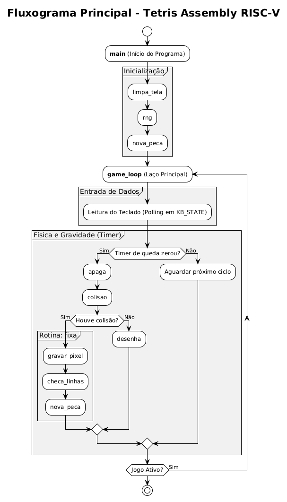

# TETRIS-in-ASSEMBLY-RISCV 

Recriação do clássico jogo **TETRIS**, desenvolvido inteiramente na linguagem Assembly para a arquitetura do processador RISC-V.

Este projeto roda em uma versão customizada do simulador de arquitetura de computadores **Ripes**, manipulando diretamente a memória física (*Memory-mapped I/O*) para controlar a matriz de LEDs e a leitura nativa do teclado de forma contínua, garantindo uma jogabilidade em tempo real sem *input lag*.

---

## Estrutura do Repositório

* **`RIPES-km`**: Pasta contendo a versão modificada do simulador Ripes com suporte aprimorado para teclado.
* **`TETORIS_FINAL.s`**: O código-fonte completo do jogo em Assembly RISC-V.
* **`Auxiliares/Funcionamento.png`**: Diagrama de fluxo do sistema.
* **`README.md`**: Este arquivo de documentação.

---

## Como Executar o Jogo (Passo a Passo)

1. Extraia os arquivos, abra a pasta `TETRIS_ASSEMBLY` e, em seguida, a pasta `RIPES-km`.
2. Execute o arquivo **"Ripes"** e, após aberto, mude o processador para **"Single-cycle processor"**.
3. Carregue no simulador o arquivo `TETORIS_FINAL.s`, localizado na pasta `TETRIS_ASSEMBLY`. Modifique o *file type* para **source_file** e pressione **OK**.
4. No canto esquerdo do Ripes, vá na aba **I/O** e selecione o **LED Matrix** e o **Keyboard**.
5. Mude o tamanho do **LED Matrix** para **10 width**, **20 height** e **26 size**.
6. Execute o simulador utilizando o botão **"Fast Execution"** (ícone de avançar rápido).
7. **Importante:** Deixe o *Keyboard* selecionado/clicado na tela para conseguir usar o teclado e controlar o jogo.

---

## Controles

As instruções de jogabilidade também estão presentes no início do código na aba "editor".

* **A / D**: Movem a peça para a Esquerda ou Direita.
* **Q / E / W**: Rotacionam a peça.
* **S**: Acelera a queda da peça (Soft Drop).
* **Espaço**: Derruba a peça instantaneamente (Hard Drop) ou reinicia a partida na tela de *Game Over*.

---

## Como Funciona (Lógica e Arquitetura)

O funcionamento interno do jogo baseia-se em um laço de repetição contínuo (*Game Loop*) que faz a escuta (*polling*) do teclado e calcula a física em sincronia com a renderização da tela.

---

## Autores

Projeto desenvolvido por:
* **Davi Sousa Alves** ([@Dabiito](https://github.com/Dabiito))
* **Gustavo Santiago de Almeida** ([@GustavoLagartixa](https://github.com/GustavoLagartixa))
* **Raul Santos da Silva** ([@rauS2](https://github.com/rauS2))
